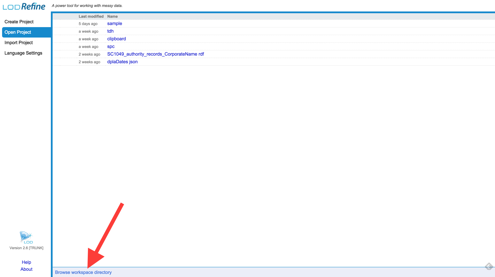
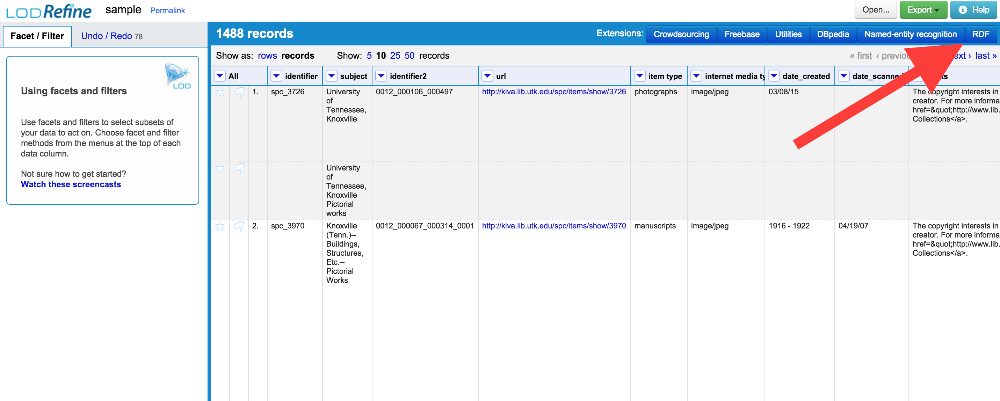

# LODLAM Workshop: Metadata Cleaning Portion Installation Instructions
## Install the DERI RDF Extension Manually
You already have or just installed OpenRefine (possibly still labeled Google Refine) on your computer, and it works for you. Great! You just need to install the DERI Extension manually (which isn't too hard, despite being 'manual').

**Note: If you installed LODRefine, or are using RefinePro, YOU DO NOT NEED THIS STEP.**

1. Find where your OpenRefine installation is on your computer. If you're not sure:
    2. Start OpenRefine however you normally do.
    3. In the OpenRefine start screen, click on the 'Browse workspace directory' link in the bottom left corner:
    
    4. This should the file directory where your installation of OpenRefine is located on your computer.
    4. If there isn't already a subdirectory named 'extensions', create it. Note where this is located.
    2. Shut down OpenRefine.
2. Download the DERI RDF Extension v.0.8.0 from [here (note this link automatically downloads a ZIP file)](https://github.com/downloads/fadmaa/grefine-rdf-extension/grefine-rdf-extension-0.8.0.zip) to your computer.
    1. Then move to the OpenRefine 'extensions' sub-directory you just created.
    2. Unzip the file.
3. Restart OpenRefine however you normally do. The RDF options button should now show up in the top right corner when you look at an OpenRefine project:

4. Next step: Go to the ['Test your install' section](OpenRefineInstallationTest.md) and make sure you're ready to go.

---

Questions? Get in touch with [Christina](mailto:cmh329@cornell.edu).

[Back to the Workshop Agenda](../README.md)

[Back to the LODLAM Toronto Agenda](https://github.com/LODLAM/LODLAMTO16)
