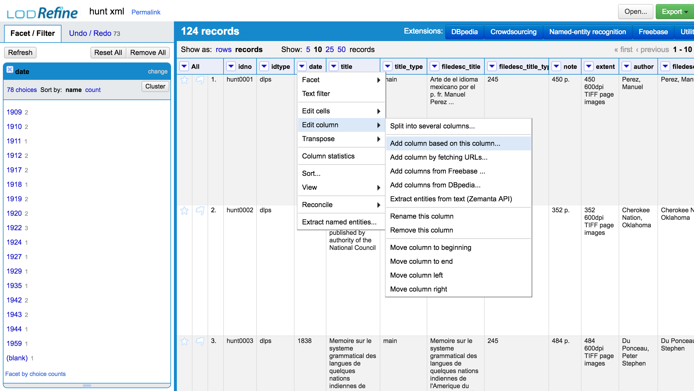

#Normalization of Data in OpenRefine

##General Normalization Functions

Check this handout for a good overview on general data cleanup functions in OpenRefine: [Owen Stephen's OpenRefine Handout](http://www.meanboyfriend.com/overdue_ideas/wp-content/uploads/2014/11/Introduction-to-OpenRefine-handout-CC-BY.pdf)

##Workshop Cheatsheet

###Trim stray whitespace


###Edit All Instances of a Value in a Faceting


###Adding a New Column based off an Existing column

First make a new column...



then apply GREL on the values you're mapping over to that new column, and give the column a name...


That GREL code:

```
value.replace('?', '').replace('-', '/')
```

You'll still need to do some cleanup on the facets.

###Compare Values in 2 columns

We're going to perform a GREL update. Choose one of the columns you wish to compare (easiest if this is the column you're okay with removing if it is an entire duplicate)...


Then build an IF statement in your GREL. The format is *IF(<condition>, action if condition is true, action if condition is false)*. *value* is the value of the cell in that chosen column; cells[column_name].values brings up the value for that cell, in the same row, for a different column. So for column values comparison:


That GREL code:

```
if(value == cells['title'].value, value.replace(value, ''), value)
```

Now faceted the updated column to see what values differ, and decide how to handle them.

###Clustering Facet values

You can also use a number of clustering algorithms built into OpenRefine for seeing what values should probably be the same. Open your relevant facet, then click on the 'Cluster' button in the top right corner of the Facets box:


You can decide to merge matched values by checking their check box, then clicking on 'Merge Selected and Recluster'. You can change the clustering algorithms in that box as well.


