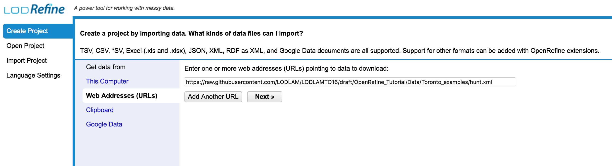
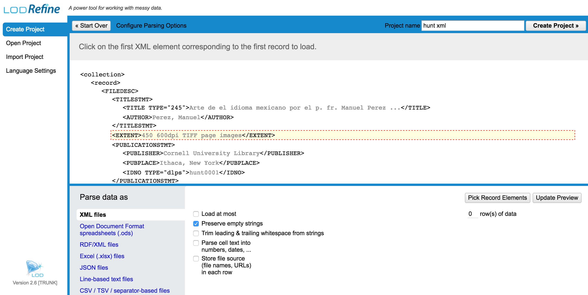

# Creating an OpenRefine Project

There are a few options for importing a dataset into OpenRefine. You can upload or import files
in a variety of formats including:
 * TSV/CSV
 * Excel files
 * JSON
 * XML
 * From a Google Spreadsheet in your drive (requires you to authorize)

##Importing Data

To import the data for the LODLAM workshop, run OpenRefine and:
 * Click ‘Create Project’
 * Choose ‘Web Addresses (URL)’
 * Enter the URL ‘https://raw.githubusercontent.com/LODLAM/LODLAMTO16/draft/OpenRefine_Tutorial/Data/Toronto_examples/hunt.xml’
 * Click ‘Next’

Your screen should look like this:

Then you should see a screen like this:

This screen is where you target the data you're importing. Depending on the type of data you're importing, you'll need to choose a 'record' delimiter field. OpenRefine uses this to create the records/rows tabular output for the application.

Play around with the options, see the results, and once you are good, click on ‘Create Project’. This will create the project and open it.

##Opening Existing OpenRefine Projects

To open an existing project in OpenRefine you can click ‘Open Project’ from the main OpenRefine screen (in the lefthand menu). When you click this, you will see a list of the existing projects and can click on a project’s name to open it.

##Importing Existing OpenRefine Projects (those tarballs)

To import an existing OpenRefine project in your OpenRefine instance:

* Import Project
* Click on Choose file. Find the OpenRefine Project you want to import - it should be a filename in the format *<filename>.openrefine (or googlerefine).tar.gz* (see image below)
* Rename the project if you like, then click 'Import'
* The project should appear - with full history from previous work on that project.

